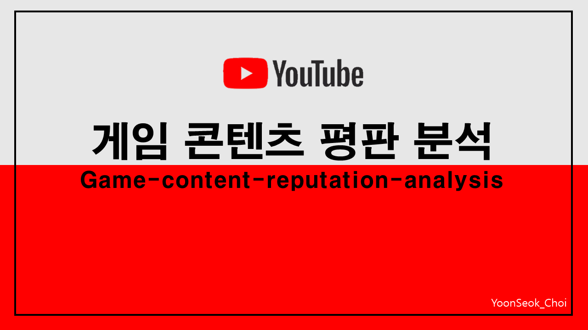

## - Welcome to choi’s GitHub
* 👨🏻‍🎓 Name : 최윤석(YoonSuk Choi)
* 💻 내용을 넣자.
* 📧 yoonsukchoi93@gmail.com

## - ⚡ 언어 및 도구

## - 🌱 교육 수료
* Korea Business News TV
  - IT융합 스마트 콘텐츠 (2017.09.01~ 2018.02.28)
* 새싹 SeSAC(Seoul Software Academy)
  - 실무요건 기반 핀테크 데이터 분석가 과정 (2023.08.28~ 2023.12.01)

## - 👏 진행상황
 

 

## - 📷 portfolio best cut

